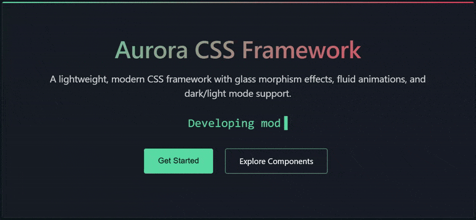

# Aurora CSS Framework


A lightweight, modern CSS framework focused on creating elegant, responsive interfaces with glass morphism effects, fluid animations, and dark/light mode support.

<p align="center">
  
</p>

## ✨ Features

- **🌓 Dark & Light Themes** - Seamless theme switching with persistent user preferences
- **🔮 Glass Morphism** - Beautiful glass-like UI components with backdrop blur effects
- **📱 Responsive Grid** - Flexible 12-column grid system that works on all devices
- **💫 Animations** - Smooth animations for scroll reveals, typing effects, and more
- **🎨 Modern Aesthetics** - Clean, modern design language with subtle gradients and shadows
- **🧩 Modular Components** - Extensible component library that's easy to customize
- **🚀 Lightweight** - Minimal footprint with no dependencies

## 📦 Installation

### 1. Via CDN (Recommended)

```html
<!-- CSS -->
<link rel="stylesheet" href="https://cdn.example.com/aurora/aurora.css">

<!-- JavaScript (Optional) -->
<script src="https://cdn.example.com/aurora/aurora.js"></script>
```

### 2. Download

[Download the latest release](https://github.com/yourusername/aurora-css/releases/latest)

### 3. NPM

```bash
npm install aurora-css-framework
```

## 🚀 Quick Start

```html
<!DOCTYPE html>
<html lang="en">
<head>
  <meta charset="UTF-8">
  <meta name="viewport" content="width=device-width, initial-scale=1.0">
  <title>My Aurora Project</title>
  <link rel="stylesheet" href="path/to/aurora.css">
</head>
<body class="aurora-dark">
  <!-- Grid Lines Background -->
  <div class="aurora-grid-lines" id="gridLines"></div>
  
  <!-- Theme Toggle Button -->
  <div class="aurora-toggle-container">
    <button class="aurora-theme-toggle" id="themeToggle">🌓</button>
  </div>
  
  <!-- Your content here -->
  <div class="aurora-container">
    <div class="aurora-glass-card">
      <h1 class="aurora-title">Hello Aurora!</h1>
      <p class="aurora-subtitle">Your beautiful UI is ready to go.</p>
      <button class="aurora-btn aurora-btn-primary">Get Started</button>
    </div>
  </div>
  
  <!-- Optional JavaScript -->
  <script src="path/to/aurora.js"></script>
  <script>
    document.addEventListener('DOMContentLoaded', function() {
      // Initialize all Aurora components
      Aurora.init();
    });
  </script>
</body>
</html>
```

## 🧩 Components

Aurora includes a variety of UI components to help you build beautiful interfaces:

### Layout
- Container & Grid system
- Responsive columns
- Flexbox utilities

### Elements
- Typography system
- Buttons & button variants
- Input controls & forms
- Cards & glass cards

### Interactive Components
- Modals
- Tooltips
- Navbar with mobile navigation
- Theme switching

### Animations
- Scroll animations
- Parallax effects
- Typing animations
- Hover transitions

## 🎨 Theme Customization

Aurora is designed to be customizable. Override the CSS variables to adapt the framework to your brand:

```css
:root {
  /* Colors */
  --aurora-accent-color: #4ecca3;         /* Primary accent color */
  --aurora-secondary-accent: #ff4d5a;     /* Secondary accent color */
  --aurora-bg-color: #0f1923;             /* Background color (dark mode) */
  --aurora-card-color: rgba(25, 31, 40, 0.7); /* Card background (dark mode) */
  --aurora-text-primary: #ffffff;         /* Primary text color (dark mode) */
  --aurora-text-secondary: rgba(255, 255, 255, 0.7); /* Secondary text (dark mode) */
  
  /* Sizes */
  --aurora-border-radius: 4px;            /* Border radius for elements */
  --aurora-grid-gap: 1.5rem;              /* Gap between grid columns */
  
  /* Transitions */
  --aurora-transition-fast: 0.2s ease;    /* Fast transition speed */
  --aurora-transition-medium: 0.3s ease;  /* Medium transition speed */
  --aurora-transition-slow: 0.5s ease;    /* Slow transition speed */
}
```

## 📚 JavaScript Utilities

Aurora includes optional JavaScript utilities to enhance functionality:

```javascript
// Initialize all Aurora components
Aurora.init();

// Or initialize components individually
Aurora.initThemeToggle();
Aurora.initScrollAnimations();
Aurora.initParallax();
Aurora.initMobileNav();
Aurora.initGridLines();
Aurora.initHighlightEffects();
Aurora.initScrollToTop();
Aurora.initModal();
Aurora.initTooltips();

// Create a typing animation
Aurora.initTyping('elementId', [
  'First text to display',
  'Second text to display',
  'Third text to display'
], {
  typeSpeed: 100,
  eraseSpeed: 50,
  newTextDelay: 2000
});
```

## 📱 Browser Support

Aurora is designed to work on all modern browsers:

- Chrome (latest)
- Firefox (latest)
- Safari (latest)
- Edge (latest)

## 📜 License

This project is licensed under the MIT License - see the LICENSE file for details.

## 👥 Contributing

Contributions are welcome! Please feel free to submit a Pull Request.

1. Fork the project
2. Create your feature branch (`git checkout -b feature/AmazingFeature`)
3. Commit your changes (`git commit -m 'Add some AmazingFeature'`)
4. Push to the branch (`git push origin feature/AmazingFeature`)
5. Open a Pull Request

## 🙏 Acknowledgements

- Inspired by modern UI/UX trends and glass morphism effects
- Thanks to all contributors who helped make this framework better
